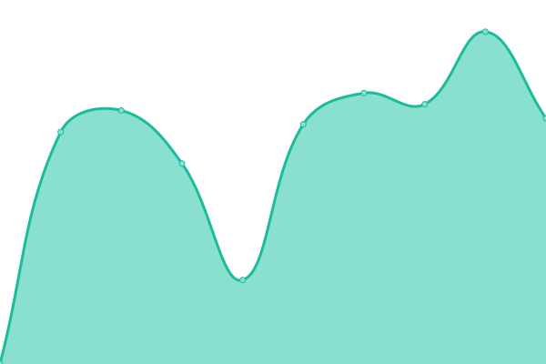

# [📈 Live Status](https://status.jrtunnel.com): <!--live status--> **🟧 Partial outage**

This repository contains the open-source uptime monitor and status page for [kalong-team](https://status.jrtunnel.com), powered by [Upptime](https://github.com/upptime/upptime).

With [Upptime](https://upptime.js.org), you can get your own unlimited and free uptime monitor and status page, powered entirely by a GitHub repository. We use [Issues](https://github.com/kalong-team/status-webssh/issues) as incident reports, [Actions](https://github.com/kalong-team/status-webssh/actions) as uptime monitors, and [Pages](https://status.jrtunnel.com) for the status page.

<!--start: status pages-->
<!-- This summary is generated by Upptime (https://github.com/upptime/upptime) -->
<!-- Do not edit this manually, your changes will be overwritten -->
<!-- prettier-ignore -->
| URL | Status | History | Response Time | Uptime |
| --- | ------ | ------- | ------------- | ------ |
|  [TurboSSH Website](https://turbossh.com) | 🟩 Up | [turbo-ssh-website.yml](https://github.com/kalong-team/status-webssh/commits/HEAD/history/turbo-ssh-website.yml) | 

 1683ms
     
 | 

<a href="https://status.jrtunnel.com/history/turbo-ssh-website">99.17%</a>
    

|  [Jrtunnel Website](https://jrtunnel.com) | 🟥 Down | [jrtunnel-website.yml](https://github.com/kalong-team/status-webssh/commits/HEAD/history/jrtunnel-website.yml) | 

 1641ms
     
 | 

<a href="https://status.jrtunnel.com/history/jrtunnel-website">51.87%</a>
    

|  [RocketSSH Website](https://rocketssh.com) | 🟩 Up | [rocket-ssh-website.yml](https://github.com/kalong-team/status-webssh/commits/HEAD/history/rocket-ssh-website.yml) | 

 1629ms
     
 | 

<a href="https://status.jrtunnel.com/history/rocket-ssh-website">92.08%</a>
    

|  [BestSSH Website](https://bestssh.net) | 🟥 Down | [best-ssh-website.yml](https://github.com/kalong-team/status-webssh/commits/HEAD/history/best-ssh-website.yml) | 

 1682ms
     
 | 

<a href="https://status.jrtunnel.com/history/best-ssh-website">100.00%</a>
    

|  [MonthlySSH Website](https://www.monthlyssh.net) | 🟩 Up | [monthly-ssh-website.yml](https://github.com/kalong-team/status-webssh/commits/HEAD/history/monthly-ssh-website.yml) | 

 928ms
     
 | 

<a href="https://status.jrtunnel.com/history/monthly-ssh-website">100.00%</a>
    

<!--end: status pages-->

[**Visit our status website →**](https://status.jrtunnel.com)

## 📄 License

- Powered by: [Upptime](https://github.com/upptime/upptime)
- Code: [MIT](./LICENSE) © [kalong-team](https://status.jrtunnel.com)
- Data in the `./history` directory: [Open Database License](https://opendatacommons.org/licenses/odbl/1-0/)
